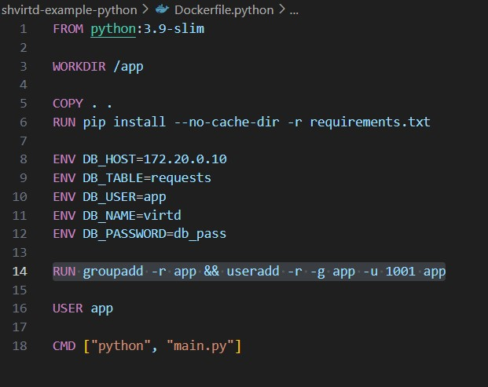
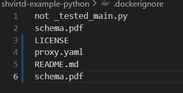
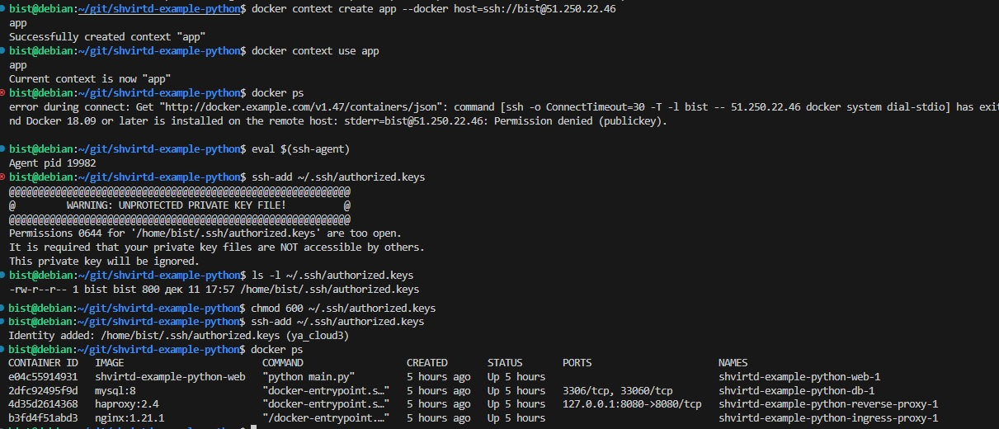

Task 1

1. Пишу докерфайл и докеригнор:

;
;

2. Тестирую сборку

;

3. Запуск приложения через venv

;

4. Добавил в код переменную таблицы и запустил

;
;

Task 2

1. Отчет сканирования

;

Task 3

Запустил и сделал sql запрос

;

Task 4

1. Bash скрипт:
#!/bin/bash

#git install
apt update && apt upgrade -y
apt install -y git

#git clone
git clone https://github.com/stbir/shvirtd-example-python /opt/shvirtd-example-python

#start
cd /opt/shvirtd-example-python
export DB_PASSWORD=QwErTy1234
docker compose up -d

2. Контейнеры запущены и работают

;

3. sql запрос

;

4. ссылка на форк реп https://github.com/stbir/shvirtd-example-python

;

Task 5
Script:
# !/bin/sh
# Определяем переменные
DB_NAME="virtd"
BACKUP_DIR="/opt/backup"
CONTAINER_IMAGE="schnitzler/mysqldump"
MYSQL_USER="app"
HOST_NAME="shvirtd-example-python-db-1"
# Запускаем контейнер
docker run  --rm --entrypoint "" \
        --name sql-backup \
  -v "$BACKUP_DIR":/backup \
  --network shvirtd-example-python_backend \
  $CONTAINER_IMAGE mysqldump --opt -h $HOST_NAME --user=$MYSQL_USER -p ${MYSQL_PASSWORD} --databases virtd --result-file=/backup/dumps.sql

  cron task - * * * * * sudo /home/bist/baskup_sql.sh

  Результат:
  ;

Task 6
Слой:
  sha256:a2291ae31714cd13ae948f4cf01a5599ea46e49e3991c0a056ba3719c8d84e21
  ;
   ;
  ;

  Task 6.1
  Запускаю контейнер
  sudo docker run -it hashicorp/terraform

  ;

Task 6.2
Docker file 
FROM hashicorp/terraform
COPY --from=hashicorp/terraform /bin/terraform  /home/bist/terr/1

;
 К сожалению копируются все файлы, но терраформ в том числе.

 